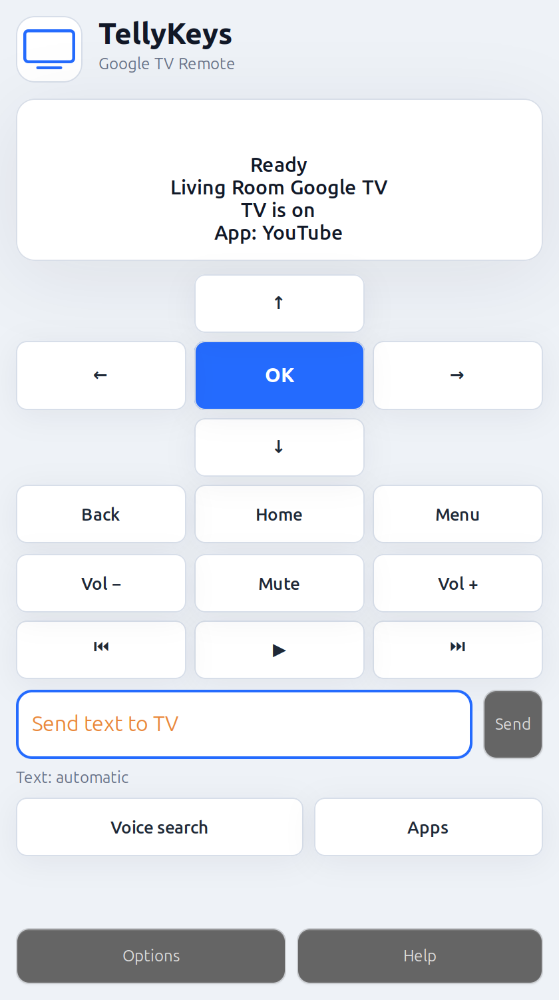

# TellyKeys

**A polished Linux desktop remote for Google TV and Android TV.**

TellyKeys gives Linux users a simple, friendly Google TV remote with pairing,
D-pad controls, app shortcuts, text input, and experimental voice search.

It is built for the “it should just work” desktop experience: discover the TV,
pair once, then use the large remote controls without thinking about protocols,
ADB, or terminal commands.

**Website:** [gaimsdevsoftware.github.io/tellykeys](https://gaimsdevsoftware.github.io/tellykeys/)



## Download

Packages will be attached to GitHub Releases as they are built:

| Platform | Package | Status |
| --- | --- | --- |
| Linux Mint / Ubuntu | [`tellykeys_0.1.0_all.deb`](https://github.com/GaimsDevSoftware/tellykeys/releases/latest/download/tellykeys_0.1.0_all.deb) | Available |
| Fedora / RPM distros | [`tellykeys-0.1.0-1.noarch.rpm`](https://github.com/GaimsDevSoftware/tellykeys/releases/latest/download/tellykeys-0.1.0-1.noarch.rpm) | Coming soon |
| Cross-distro Linux | [`org.gaimsdevsoftware.TellyKeys.flatpak`](https://github.com/GaimsDevSoftware/tellykeys/releases/latest/download/org.gaimsdevsoftware.TellyKeys.flatpak) | Coming soon |

Until the first release assets are uploaded, install from source:

```bash
git clone https://github.com/GaimsDevSoftware/tellykeys.git
cd tellykeys
python3 -m venv --system-site-packages .venv
. .venv/bin/activate
python -m pip install -e .
tellykeys
```

Linux Mint dependencies:

```bash
sudo apt install python3-gi gir1.2-gtk-3.0 avahi-utils pipewire-bin pulseaudio-utils
```

Fedora dependencies:

```bash
sudo dnf install python3-gobject gtk3 avahi-tools pipewire-utils pulseaudio-utils
```

## Highlights

- Finds Google TV / Android TV devices on the local network.
- Pairs with the six-character code shown on the TV.
- Large, simple remote buttons for D-pad, OK, Back, Home, Menu, volume, mute, and media.
- App shortcut popover with editable/removable buttons.
- Text input with contextual YouTube search fallback.
- Experimental voice search using the Linux microphone.
- Tray mode and optional Cinnamon applet.
- Settings and help pages built into the app.

## How It Works

TellyKeys uses Android TV Remote Protocol v2 through
[`androidtvremote2`](https://github.com/tronikos/androidtvremote2), the same
family of network remote protocol used by the official Google TV mobile app.

ADB is not required for normal pairing and remote control. ADB is only used as an
optional fallback for text input and some system settings shortcuts.

Pairing data is stored locally:

```text
~/.config/tellykeys/
```

## Text Input

Text input is difficult on Google TV because apps behave differently.

TellyKeys uses several strategies:

- YouTube: opens a YouTube search URL directly when YouTube is active.
- ADB: optional fallback when developer/network debugging is enabled.
- Remote IME: Google TV remote text protocol fallback.

If text does not appear, open `Options > Text > Text input help`.

## Voice Search

Voice search is experimental but working on the protocol side.

TellyKeys opens a Google TV voice session and streams microphone audio as
16-bit PCM, mono, 8000 Hz. On PipeWire systems it prefers `pw-record`; `parec`
is used as fallback.

If Google TV opens voice search but does not hear you:

1. Open `Options > Text`.
2. Select the real microphone source, not a monitor source.
3. Press `Test mic`.
4. Try `Voice search` again.

Voice search auto-stops after:

- 3 seconds of silence after speech was heard
- 8 seconds if no speech is heard

## Keyboard Shortcuts

When the main window has focus and you are not typing in a text field:

| Key | Action |
| --- | --- |
| Arrow keys | D-pad |
| Enter | OK |
| Backspace / Escape | Back |
| Home | Home |
| Space | Play / Pause |
| `+` / `-` | Volume |
| `m` | Mute |
| `p` | Power |

## Optional Tray And Cinnamon Applet

Run in tray mode:

```bash
tellykeys --tray
```

Start hidden in the tray:

```bash
tellykeys --start-hidden
```

Install the Cinnamon applet from source:

```bash
scripts/install-cinnamon-applet
```

## Building Packages

Build a Debian package for Linux Mint / Ubuntu:

```bash
scripts/build-deb
```

Build an RPM package for Fedora / RPM distros:

```bash
scripts/build-rpm
```

Build a Flatpak bundle:

```bash
scripts/build-flatpak
```

Build outputs are written to:

```text
dist/
```

## Project Status

TellyKeys is under active development. The Linux Mint/Cinnamon experience is the
primary target right now, with Fedora/RPM and Flatpak packaging being added next.
macOS and Windows ports are planned later.

Known rough edges:

- Voice search depends on TV support for third-party remote voice sessions.
- App-specific text input varies by TV app.

## Similar Linux Tools

Linux has several CLI tools for Android TV / Google TV remote control, including
`gtv-remote`, `androidtv-remote-cli`, `atvremote`, and ADB wrappers.

TellyKeys aims to be the polished GTK desktop app version: approachable,
visual, and comfortable for daily use.
